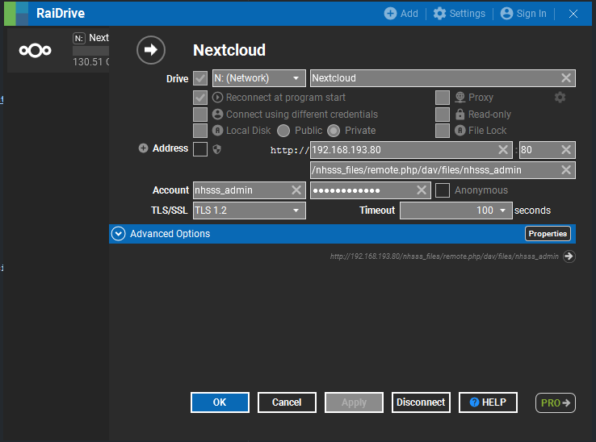

NHS-DF
===
---

The National HIV-STI Data Factory (NHS-DF) serves as the framework for the data pipelines used to generate the various datasets used by the National HIV/AIDS-STI Surveillance & Strategic Information Unit (NHSSS) of the Department of Health's Epidemiology Bureau (DOH-EB).

Author/s:

- [Palo, John Benedict](https://www.facebook.com/Bene.Palo/)

Team Members:

- [Palo, John Benedict](https://www.facebook.com/Bene.Palo/) _(Data Specialist)_
- [Haynes, Ruela](https://www.facebook.com/ruela.haynes/) _(Surveillance Officer)_
- [Yap, Frances Giul](https://www.facebook.com/omggiul/) _(Surveillance Officer)_
- Saplagio, Niel Gabriel _(Surveillance Officer)_

Data:

- [HIV/AIDS & ART Registry of the Philippines](https://doh.gov.ph/statistics)
- Integrated HIV Behavioral & Serologic Survey 

---

Project Dependencies
-------------------------

### Required

- R
- [Raidrive](https://www.raidrive.com/download)
- [git](https://git-scm.com/download/win)
- [Java SRE](https://www.oracle.com/ph/java/technologies/javase/javase8-archive-downloads.html)
- [PyCharm Community](https://www.jetbrains.com/pycharm/download/#section=windows)
- [Path Copy Copy](https://pathcopycopy.github.io/)
- PyCharm plugins:
    - `R Language for IntelliJ`

### Optional

Installation Instructions
-------------------------

1. Install PyCharm
2. Add VCS
3. Manage Remotes (origin = http://130.105.75.3:3000/nhsss_admin/ohasis-dqt.git)
4.
5. Make your own branch (initials, lastname, .doh) jrpalo.doh
6. Pull

[To be added.]

Mount Network Drive
-----

1. Install Raidrive
2. In the Raidrive windows, click "Add" in the menu panel
3. Copy the settings found in the image below



Misc.
-----

1. Install the PyCharm Plugin

PDF Rendering Tool/s
--------------------

1. Download `Quatro CLI` from this link: https://quarto.org/docs/get-started/
2. Install `tinytex` via CLI:
    - `quarto tools install tinytex`

---

Directory Structure
-------------------

### Parent-level

This project's directory structure was created to account for team collaboration in the management and wrangling of
OHASIS data.

```
DQT
├───archive
├───data
├───ref
└───src
```

**Primary Code Library**

- `src` - cotnains all related code used to generate any OHASIS-extracted dataset.

**Auto-Output Directories**

- `archive` - all input files are copied and cleaned into this directory during consolidation. Scripts, input and output
  files, and references are all automatically copied here.
    - _NOTE: Include files here in `.gitignore`_

**User Input Directories**

- `data` - various OHASIS output data to be placed here if needed in processing subsets. Takes output files from
  the `archive` directory.
    - _NOTE: Include files here in `.gitignore`_

- `ref` - contains various standard translations and corrections that can be done across any reporting month's
  consolidation.

### Second level

Three of the four sub-directories are stratified accordingly by reporting date, taking the format `yyyy.mm`. This is to
take into consideration each month's specific nuances with reporting and consolidation.

The files inside the `ref/.all` sub-directory are data corrections that are not specific to any reporting date, and are
thus part of the standard running for any reporting month/quarter.

```
DQT
├───archive
│   └───2021.08
│
├───data
│   └───2021.08
│
└───ref
    ├───.all
    └───2021.08
```

The `src` directory is divided into the different types of output files the scripts can generate. These have further
stratification to delineate between the different exported data they output.

- `data_lake` - scripts run to populate the data lake.

- `dependencies` - code requirements when running the project.

- `official` - NHSSS final output datasets.

- `data_warehouse` - OHASIS first-level exports (Forms, Inventory, etc.).

- `template` - template files used to design automated reports/briefers.

```
DQT
└───src
    ├───data_lake
    ├───data_warehouse
    ├───dependencies
    ├───official
    ├───ohasis
    └───templates
```

---

Patient matching within a Health Information Exchange[^1].

[^1]: https://www.ncbi.nlm.nih.gov/pmc/articles/PMC4696093/
